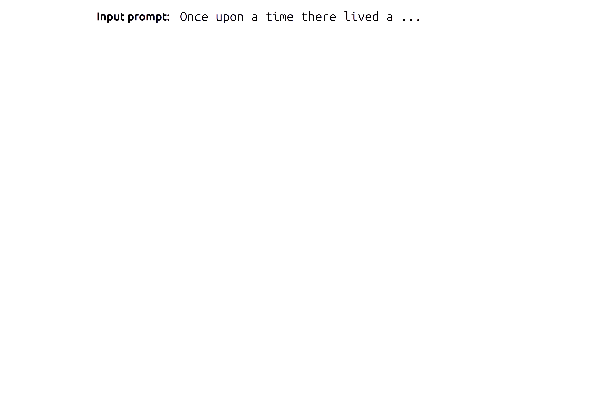
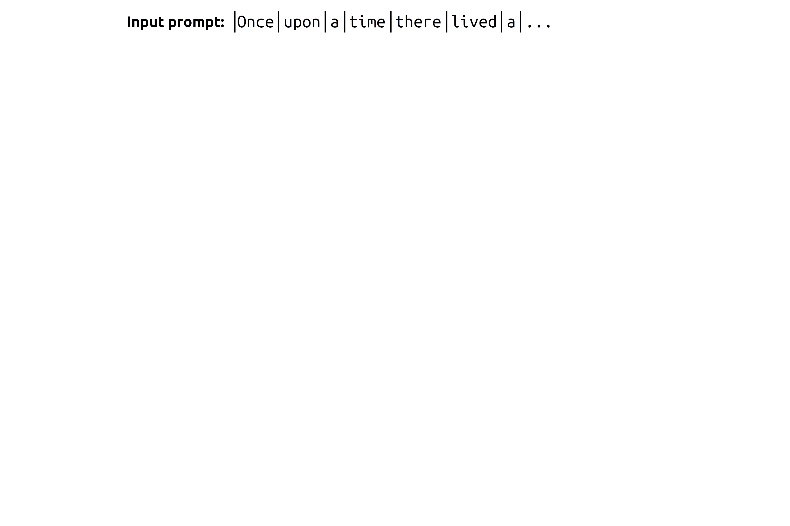
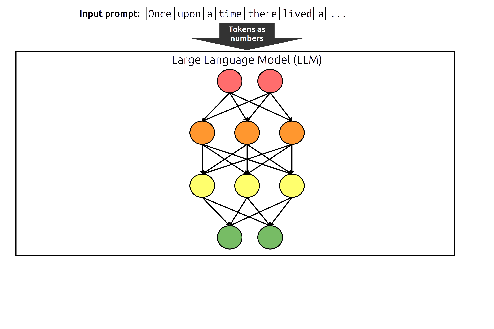
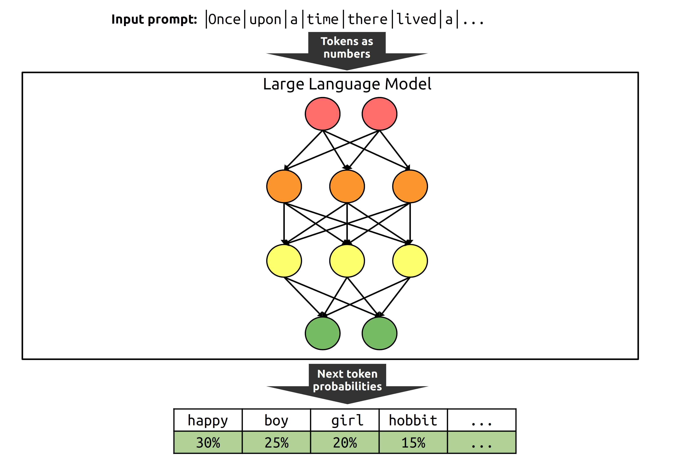
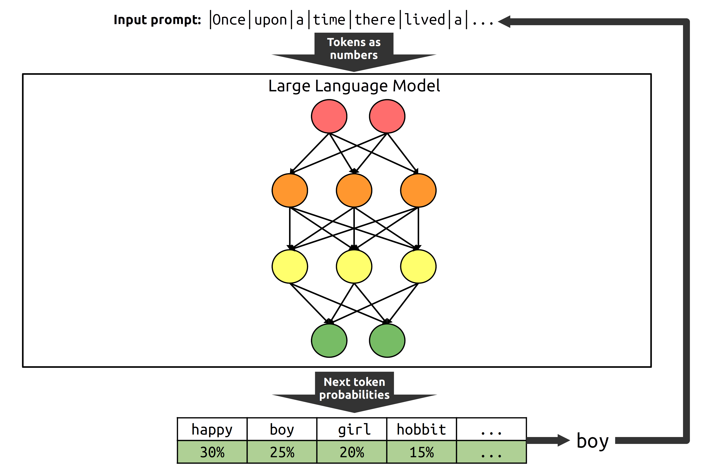
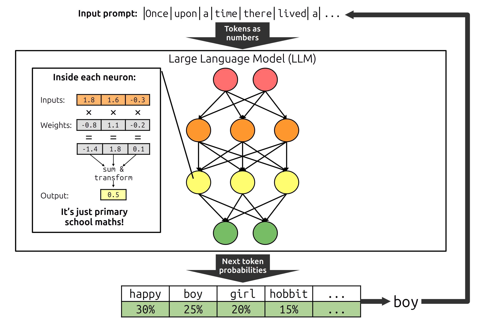
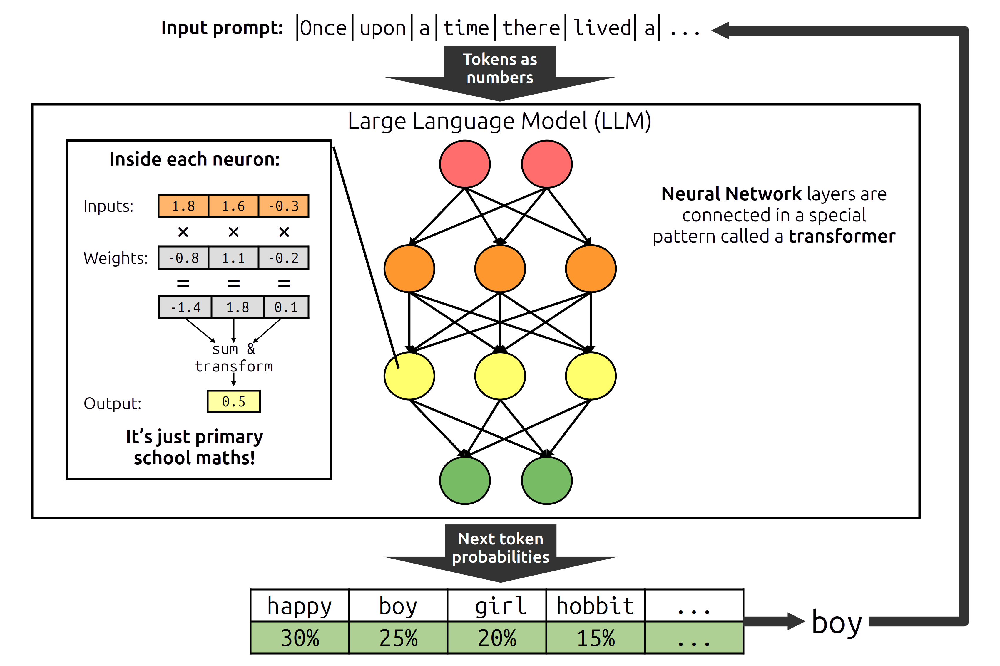
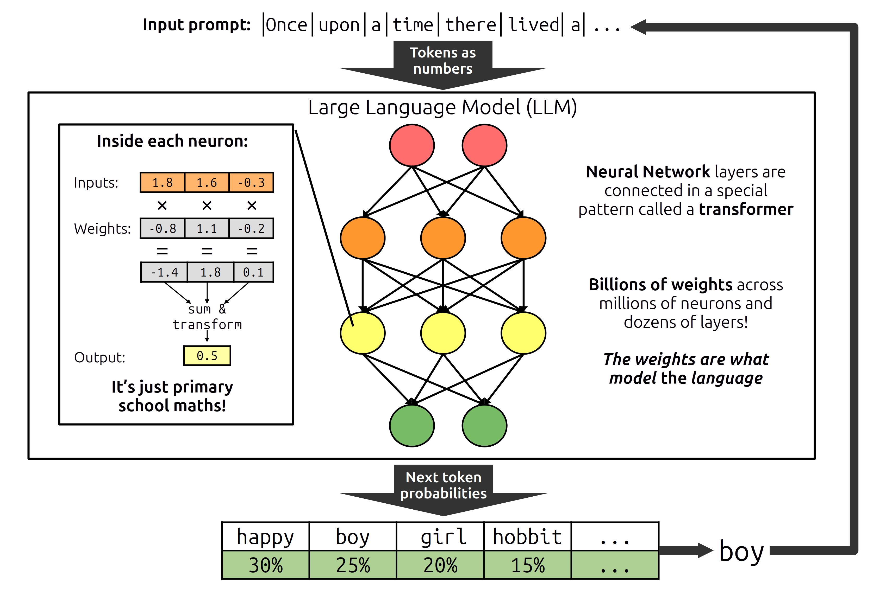

### Get Ready for AINoon!

* Open [technoon.org/ainoon](https://technoon.org/ainoon)
* Log in with a free account to [chatbase.co/dashboard](https://chatbase.co/dashboard)

### Thanks

* To the host for the great venue!
* To our sponsors

### Administrivia

* Fire escapes
* Toilets
* Cleaning up after ourselves
* Wi-Fi

### Demystifying AI

How generative AI works and how that informs how to best use it

### How does a chatbot generate text?

<aside class="notes">

* The chatbot predicts what text comes next, one word at a time
* The prompt is split into tokens (words or parts of words)
  * Services usually charge you for each input and output token
* Tokens are passed into a "large language model" or "LLM"
  * Each token is represented as a number
* Those numbers are processed by a series of layers of "neurons"
* The final layer outputs a probability for each possible token that could come next
* A token is randomly picked based on those probabilities
  * Some chatbots let you choose a temperature - a lower temperature is less random
  * i.e. The highest probability is more likely to be picked with a lower temperature
* The chosen token is added to the prompt, and the whole process is repeated to get the next token
* Each neuron multiplies each input by a weight, sum the result, and applies a transformation to produce a single output number
  * Loosely inspired by a neuron in the brain
  * It's just primary school maths!
  * You may have heard AI needs special pieces of hardware Graphic Processing Units or GPUs
    * It's because they can do lots of this maths very fast
* The layers are connected in a special pattern called a "transformer"
* The transformer architecture from Google in 2017 was the breakthrough that led to ChatGPT
* There are millions of neurons, with billions of weights, meaning billions of multiplications!
  * When someone says "OpenAI's GPT-3 has 175 billion parameters", they're counting the weights
  * Models keep getting bigger, which lets them more accurately predict which token comes next
* Image, audio, and video models are similar
  * But different kind of chunks are used as tokens

</aside>

### Where do LLM weights come from?

::: incremental

* Weights start as random numbers
* Weights are updated by a process called **pre-training**:
  * Uses millions of *training examples* from **general sources**,
    like the internet and books
  * E.g. Leave-one-word-out examples:
     `The Beatles were a ____ from England` → `band`
  * For each example, weights are updated *slightly* to get closer to
    the right answer - like tuning a dial
  * This trains the LLM in **language patterns** AND **general knowledge**
* Extra training based on **human feedback** makes chatbots respond
  better to **questions** and **instructions**
   (e.g. Chatbot gives 5 answers and human picks the best)

:::

### You now understand what GPT stands for!

<table>
<tr><td><strong>Generative</strong></td><td>The model generates text (or other content)</td></tr>
<tr><td><strong>Pre-trained</strong></td><td>Pre-trained on many examples from general sources</td></tr>
<tr><td><strong>Transformer</strong></td><td>The kind of neural network architecture used</td></tr>
</table>

### What does this teach us about using GenAI?

<ul>
<li class="fragment">The generation process is **not magic, just simple maths!**</li>
<li class="fragment">We know *how* AI works, but **we can't interpret its decision-making**
  <ul>
  <li>The billions of calculations across neurons are too complex</li>
  </ul>
</li>
<li class="fragment">**AI doesn't "think" with logic** - it's predicting the best answer based on its training sources
  <ul>
  <li class="fragment">People say AI *sometimes* "hallucinates" wrong answers - but every response is generated the same way</li>
  <li class="fragment">It generates answers that *sound* right - and it's surprising so many actually are right!</li>
  </ul>
</li>
<li class="fragment">**Training happens every few months - not during your chats**
  <ul>
  <li>It "remembers" by including chat history in the prompt</li>
  <li>Even "memory" features just include past chats in the prompt</li>
  <li>Public chatbots may use your chats to train later models</li>
  </ul>
</li>
</ul>

### GenAI Strengths and Limitations

#### Key Strengths

* Generates text that looks similar to what a human would write
* Reads lots of text really fast
* Surprisingly good responses to a wide variety of tasks

#### Key Limitations

<ul>
<li>Everything is a hallucination - but it's correct surprisingly often</li>
<li class="fragment">It might not always "pay attention" to everything in the prompt</li>
<li class="fragment">It might not consistently give the same answer</li>
<li class="fragment">Different models (or model versions) can give very different responses to the same prompt</li>
<li class="fragment">It only "knows" whats in its training data (usually 1-2 years old)
  <ul>
  <li>Pairing it with web search mitigates this</li>
  </ul>
</li>
</ul>

### Tutorial Objective

Make your own chatbot to answer questions based on information in a
document

### Testing a Chatbot

**Either you test your chatbot, or your users will!**

<ul>
<li class="fragment">Make a **list of questions** you want it to answer</li>
<li class="fragment">Ask each question **multiple times** to check it consistently gives the right answer</li>
<li class="fragment">**Amend instructions or sources** to improve answers</li>
<li class="fragment">Re-test all questions **after any change**
  <ul>
  <li>Changes to instructions, knowledge, or model</li>
  <li>Using a system to automate testing helps!</li>
  </ul>
</li>
<li class="fragment">**Test edge cases**
  <ul>
  <li>How does it respond to off-topic questions?</li>
  <li>If a user reports a failure, add a new test!</li>
  </ul>
</li>
</ul>

### Homework

1. **Make a list of questions** you want your chatbot to be able to
   answer
   * Feel free to use a different source document!
2. **Ask each question** and note whether it was correct
3. For questions it got wrong, **modify the source** to help it get
   the right answer
4. **Test it again!**
   * Is it right more often?
   * Is it wrong for any questions it got right before?

**Extra:** Learn more about how LLMs work with
a [brief explainer](https://www.youtube.com/watch?v=LPZh9BOjkQs) or
a [deeper dive (more maths)](https://www.youtube.com/watch?v=wjZofJX0v4M) from
3Blue1Brown.

