### Get Ready for AINoon!

* Open [technoon.org/ainoon](https://technoon.org/ainoon)
* Log in with a free account to [zapier.com](https://zapier.com)

### Thanks

* To the host for the great venue!
* To our sponsors

### Administrivia

* Fire escapes
* Toilets
* Cleaning up after ourselves
* Wi-Fi

### Common Patterns for AI Apps

* Retrieval Augmented Generation (RAG)
* Tools
* Agents

Understanding what's possible will enable you to spot opportunities.

### Most AI apps are surprisingly simple

Clever preparation of prompt/context +

GenAI model to generate text, images, etc.

+ Clever use of model outputs

<aside class="notes">

* AI apps are heavily based around using GenAI to generate content,
  just like we've seen in earlier lessons
* The rest is just clever tricks of how:
  * The prompt (or context) is prepared
  * The outputs of the model are used
* We're going to look at the most common tricks

</aside>

### Retrieval Augmented Generation (RAG)

::: incremental

* **Problem:** LLMs can answer questions about general knowledge from
  training data, but have no knowledge of your domain/company
* **Expensive solution:** Continue to train ("fine-tune") the model on
  your own text
* **Pragmatic solution:** *Retrieve* relevant text and add it to
  *augment* the prompt

:::

<aside class="notes">

* We saw this in last week's tutorial where we added knowledge sources
  to a custom chatbot

</aside>

### Selecting relevant text for RAG

<ol>
<li class="fragment" data-fragment-index="1">**Break up documents** into *chunks* of text</li>
<li class="fragment" data-fragment-index="2">When a user's question comes in, **search** for relevant chunks of text
<ul>
<li class="fragment" data-fragment-index="3" style="font-size: 0.7em;">Usually by finding chunks with the **most similar "meaning"** to the question according to a specialised *text embedding model*</li>
</ul>
</li>
<li class="fragment" data-fragment-index="4">Add relevant chunks to the prompt</li>
</ol>

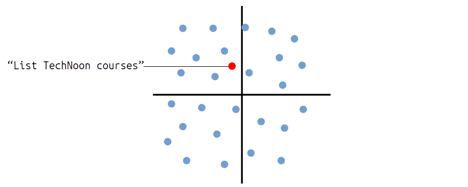
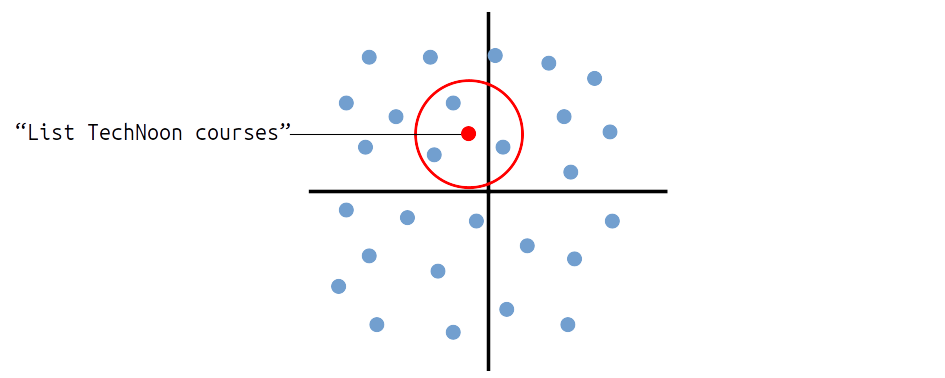
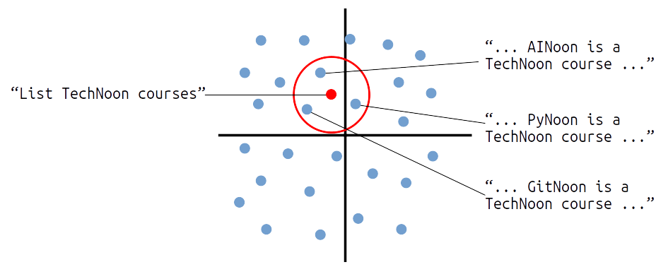

### Challenges with RAG

* Getting accurate knowledge sources
  * Garbage in, garbage out
* Configuring search to find the best chunks
* Ensuring chunks include *all* relevant context

### Tools - Expanding LLM Capabilities

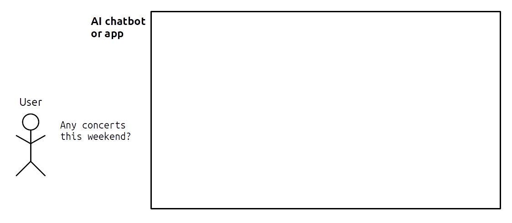

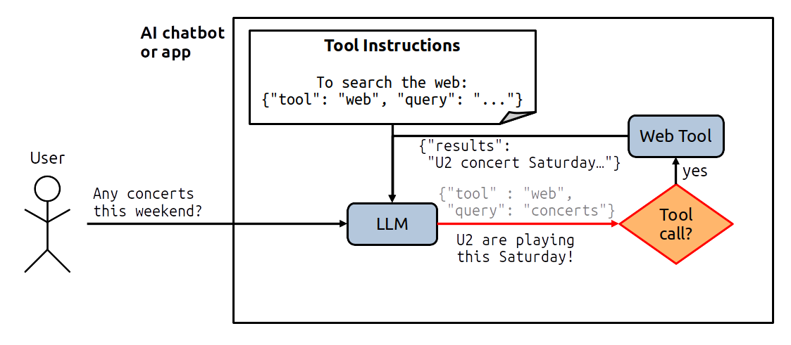
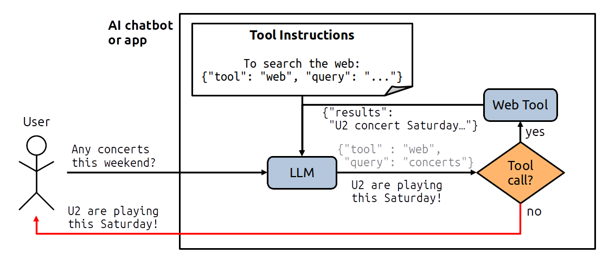
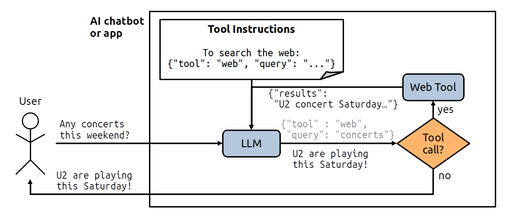

**Key idea:** The LLM decides when to call a tool

<aside class="notes">

1. Users asks for something the LLMs can't answer by itself
   * E.g. training data is old, and won't include upcoming concerts
2. A set of available tools is described in the prompt
   * Includes what the tool does and how to call it
3. If the LLM output is in the format of a tool call...
4. ...the output is passed to the tool
5. The tool does it's job, and *its* output is passed back into the
   LLM as part of the prompt
6. Now the LLM is able to generate an answer for the user
7. Which is then passed back to the user

</aside>

### Examples of Tools

* **Fetch data:**
  * Web or document search (RAG tools)
  * Run code (e.g. to analyse a spreadsheet)
  * Fetch data from a system (e.g. task management)
  * Ask human for input (e.g. review a decision)
* **Take action:**
  * Write to a file
  * Send a message
  * Update data in a system

### Providing Tools to a Chatbot

::: incremental

* Many chatbots have built-in tools, or allow you to provide your own
  * E.g. You can enable *Web Search* in ChatGPT
* Many systems now provide an [MCP server](https://modelcontextprotocol.io/docs/getting-started/intro)
  that provides tools in a standard format for any AI app
  * E.g. An MCP server for files on your computer allows the LLM to
    read/write any file it chooses

:::

### Agents / Agentic AI

Vague term with lots of meanings, but one useful definition is:

> An LLM agent runs tools in a loop to achieve a goal
> - [Simon Willison](https://simonwillison.net/2025/Sep/18/agents/)

(so that tool example was technically an agent)

### Example of an Agent

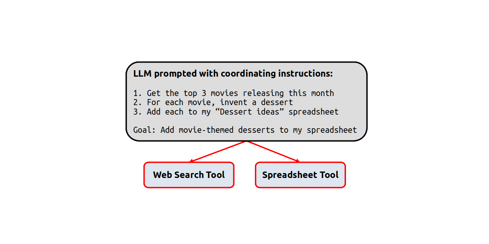
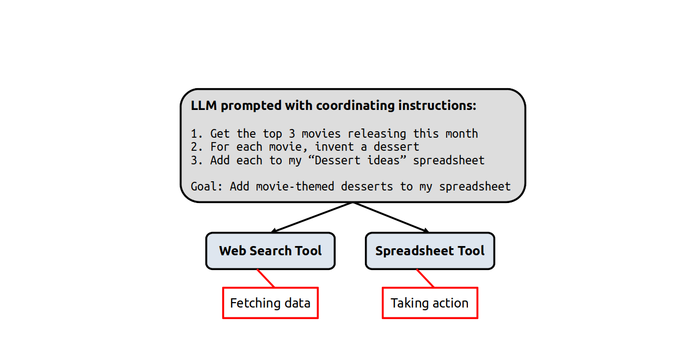
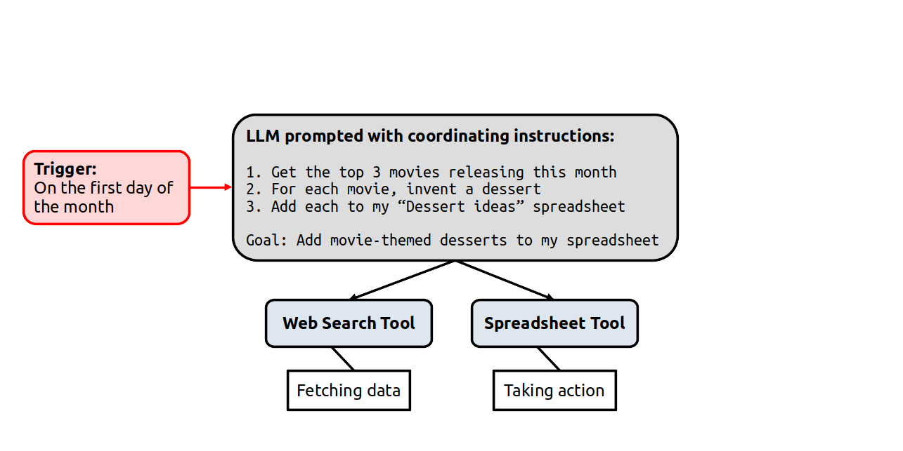
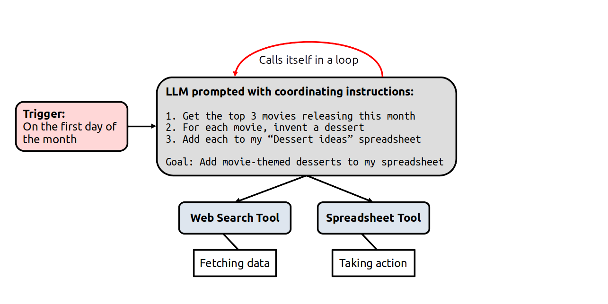
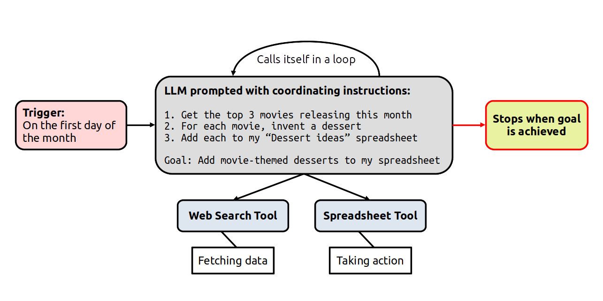
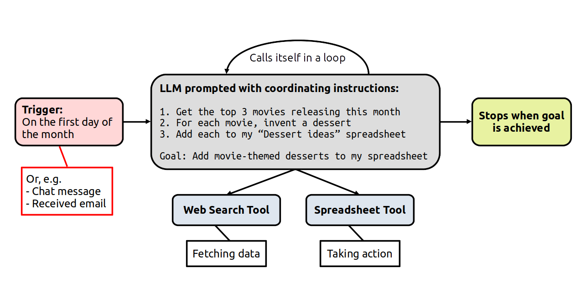

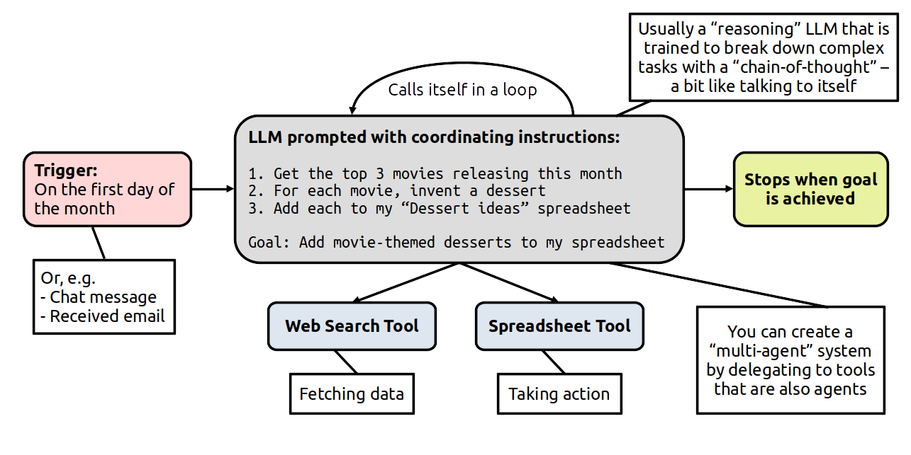

<aside class="notes">

Let's say we're a restaurant who wants to attract diners with desserts
themed for upcoming movie releases.

1. We'll call the LLM with instructions for the agent's task
   * *Talk through each step, including the overall goal*
2. We need to provide any tools that the agent needs to complete its
   goal:
   * A tool to search the web for movies
   * A tool to update the spreadsheet
3. These are good examples of tools that *fetch data* and *take
   action*
4. We'll configure a trigger to run the agent on the first day of
   every month
5. As we saw in the tools example, the LLM will be called in a loop as
   it chooses to execute tools, makes use of the results, executes
   more tools...
6. ...and so on until the goal is achieved

Some things to note about this pattern:

1. A variety of events can be used to trigger an agent
   * When a chatbot receives a message
   * When an email lands in your inbox
2. Agents typically use a **reasoning** LLM
   * Specially trained to approach complex tasks with
     *chain-of-thought*
   * It basically "talks to itself"
3. You can expand this into a **multi-agent** system
   * A top-level coordinator LLM calls other agents like they are
     tools
   * Each agent has instructions and tools to perform a specific task

</aside>

### Examples of Agents

* **Deep Research** for extensive web searches (ChatGPT)
* **NotebookLM** for research and study (Google)
* **Copilots** that automate tasks in apps (e.g. Outlook, Excel)
* **GitHub Copilot**, **Claude Code**, and **Aider** for writing code
* As one part in an automation workflow (e.g. **n8n** workflows)

### Tutorial Objectives

Let's build that movie desserts agent!

* Set up a table to store the dessert ideas
* Configure the agent instructions and tools
* Test the agent!

We'll also use Zapier's "copilot" agents along the way to help us make
the table and agent!

### Homework

* Try ChatGPT's **Think longer** (reasoning) mode:
  * "Make a plan to increase visitors to my website"
  * Compare level of detail with/without reasoning
* Try ChatGPT's **Deep Research** agent:
  * "Find a cheap washing machine for a family of four"
  * Searches the web and summarises in a few minutes
* Extend your *Desserts* agent into a **multi-agent system**:
  * Make a new *Recipe* agent that takes a dessert description and
    generates a recipe for it
  * Use the *Call an agent* tool from your *Desserts* agent to call
    the *Recipe* agent for each dessert description
  * Add a `Recipe` long-text column to your table so that the
    *Desserts* agent can include the recipe in each row
    * Remove and re-add the *Zapier Tables* tool to see the new column

