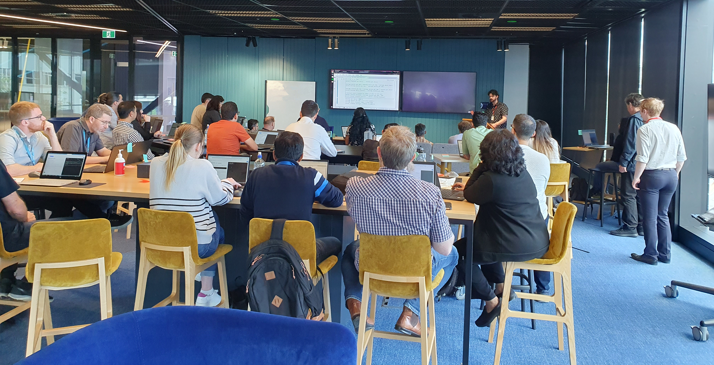

TechNoons are brief, free, industry-led, in-person training courses
run at lunchtimes for people in technical jobs wanting to improve
their skills. TechNoon courses will usually have four sessions of 2-3
hours each (including homework).

## If you want to learn a new skill…

See if there are any [upcoming courses](/courses) in your area. If you
don't see something please make a suggestion using the [TechNoon
Contact Form](/contact) and we'll get back to you to find out more.

## If you want to teach a short course…

We'd love to talk to you. Just fill in the [TechNoon Contact
Form](/contact) and we'll get back to you to find out more. Read the
[TechNoon Manifesto](/manifesto) first to get a feel for the core
concepts of TechNoon. If a course on the topic has already been run
there may be resources you could reuse.

## If your company wants to participate…

Perhaps you would like to improve staff skills in a specific area. Or
maybe some of your staff would like to provide trining. Either way
we'd love to hear from you. Please fill in the [TechNoon Contact
Form](/contact) and we'll get back to you to find out more.

## Why TechNoon is needed

* **Tertiary degrees and diplomas** are not a good answer for people
  already in jobs. Even boot-camps are a significant challenge for
  most people with job commitments. Courses also tend to be too
  general with hit-and-miss content for people in specific roles.
* **On-line courses** and **individual articles and documentation**
 can't provide the individualised support and the motivation that an
 in-person course can.
* **Internal corporate training** can't achieve the economies of scale
  and specialisation of an industry-wide training ecosystem.
* **Vendor training** doesn't cover the range of skills required and
  is not focused primarily on what is good for industry.

## Is there a catch?

**No** - TechNoon has emerged from the open source software community
and brings that ethos to technical training. The open, collaborative
approach to software development has revolutionised the world of
programming like it revolutionised science centuries earlier. Now it's
training's turn.

## Who runs TechNoon?

Anyone who wants to run a TechNoon can do so - people can decide
whether to attend or not based on the trainer's bio, the course
outline, and the credibility of the trainer's organisation.

## What's with the cowboy hat logo?

TechNoon started as [PyNoon](https://pynoon.github.io) (Python
programming training) before broadening out and PyNoon's logo is a
cowboy snake logo. PyNoon is a reference to the classic movie *High
Noon*, thus the Western, cowboy theme.
