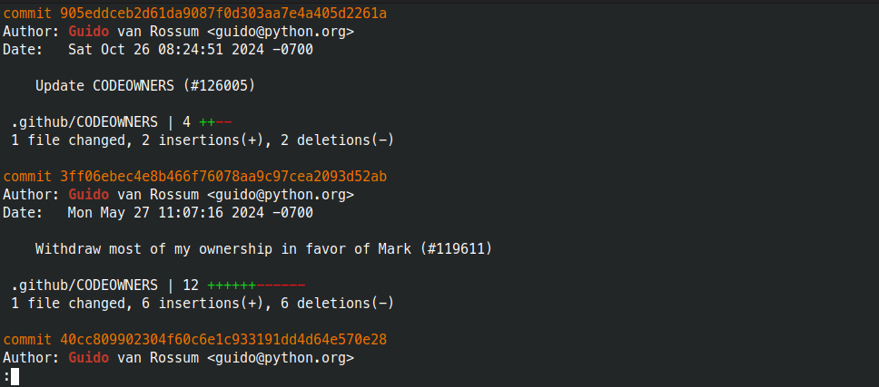
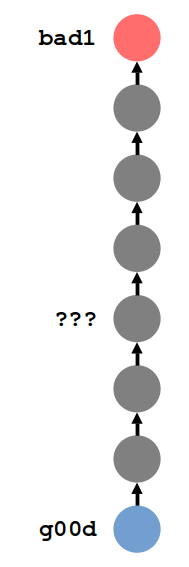

### Get Ready for Lesson 2!

<div style="font-size: 0.85em;">

1. Login to your account on [github.com](https://github.com/)
2. If you missed the last lesson, ask for help setting up a `blog` repository to share:
   ```
   mkdir blog
   cd blog
   git init
   echo "# Entry 1" > entry_1.md
   git add entry_1.md
   git commit -m "Add first blog entry"
   git status
   ```

</div>

### Thanks

* To the host for the great venue!
* To our sponsors

### Administrivia

* Fire escapes
* Toilets
* Cleaning up after ourselves
* WiFi

### Lunch Talk: Exploring History

* Getting value from the time you spend crafting clean commits and
  helpful commit messages
* Our key tools:
  * `git log`
  * `git blame`
  * `git bisect`
* The power of plain text

### Answering Questions with `git log`

* We've already used `git log` to list commits
* `git log` can be customised with **options**
* Hold **arrow keys** to scroll up and down
* `git log --help` lists the available options


### *What has Guido worked on lately?*

`git log --stat --author "Guido"`



* `--stat` counts lines changed in each file

### *What is the history of our README?*

`git log --stat --follow -- README.rst`


<div style="font-size: 0.8em;">

* `--follow` includes commits made when the file had another name (Git
  can follow most renames)
* The `--` tells Git that what comes next is a file

</div>

### *How was issue 123458 fixed?*

`git log --grep "gh-123458:"`


<div style="font-size: 0.8em;">

* `--grep` searches commit messages - so make them useful!
  * Follow project conventions (like including issue numbers)
  * Include keywords relating to your work

</div>

### *When was `parse_entry` removed?*

`git log --patch -S "parse_entry"`


<div style="font-size: 0.8em;">

* `-S` searches the contents of lines changed
  * Known as the *Git Pickaxe*
* `--patch` shows the diff of each commit

</div>

### Combine options for more power!

Answer very specific questions like:

> Didn't Ben make an important change to `login.html` the week before
> we went on holiday?

```
git log \
    --author Ben \
    --since 2023-12-18 \
    --until 2023-12-22 \
    -- login.html
```

### *Who wrote this?*

`git blame -- README.rst`


<div style="font-size: 0.8em;">

* For each line, find out: **who**, **when**, and **which commit**
* Use `git show 914476` to see the contents of a commit
* Ignore whitespace changes with `-w`
* Follow copy-pasting within the file (`-M`) or whole repo (-`C`)

</div>

### *When did this break?*

<div style="display: flex;">
<div style="flex: 2;">

<ul style="font-size: 0.9em;">
    <li class="fragment" data-fragment-index="1"><code>git bisect start bad1 g00d</code><ul><li>Git "checks out" commit halfway between for you to inspect</li></ul></li>
    <li class="fragment" data-fragment-index="2"><code>git bisect good</code></li>
    <li class="fragment" data-fragment-index="3"><code>git bisect bad</code></li>
    <li class="fragment" data-fragment-index="4"><code>git bisect bad</code></li>
    <li class="fragment" data-fragment-index="5">To clean up:<br><code>git bisect reset</code></li>
    <li class="fragment" data-fragment-index="6">If you can't test a commit:<br>`git bisect skip`</li>
    <li class="fragment" data-fragment-index="7">You can even supply a test script!</li>
</ul>

</div>
<div style="flex: 1;">

<div class="r-stack"></div>

</div>
</div>

### The Power of Plain Text

<div style="font-size: 0.65em;">

* We've seen compelling reasons to track your projects with Git
  * And why to write small, self-contained commits with good messages!
* Like many "Unix" tools, Git is especially good for **plain text**
  * `git diff`, `git blame`, Git pickaxe, etc.
* E.g. **Markdown** for formatted text as readable plain text:

</div>

<a href="https://dillinger.io/"></a>


### Plain Text Tools

* Conversion (e.g. `.md` to `.docx`) → [Pandoc](https://pandoc.org/)
* Diagrams → [Mermaid](https://mermaid.js.org/)
* Markdown/HTML slides → [Reveal.js](https://revealjs.com/)
* Markdown websites → [Jekyll](https://jekyllrb.com/), [Decap CMS](https://decapcms.org/)
* Documentation sites → [Docsify](https://docsify.js.org/), [MkDocs](https://www.mkdocs.org/)
* "Infrastructure as code" → [OpenTofu](https://opentofu.org/),
  [Ansible](https://www.ansible.com/)
* Accounting → [plaintextaccounting.org](https://plaintextaccounting.org/)


### Tutorial Objectives

1. Configuring your GitHub account to support SSH authentication
2. Sharing repos on GitHub
3. Updating remote and local repos
4. Instructing Git to ignore certain files
5. Publishing a repo as a website on GitHub


### Homework

<div style="font-size: 0.75em;">

1. **History exploration exercises**
   * Clone the "awesome lists" repo:
     [github.com/sindresorhus/awesome](https://github.com/sindresorhus/awesome)
   * Use Git to answer the following questions:
     1. Who was the last person to edit the license and why?
     2. When was "ChatGPT" added to the list?
     3. Find all commits with the message "Meta tweaks"
     4. What was the first commit by user `RichardLitt`?
2. **Continue your daily blog entries**
   * Start pushing to your remote repo as well
   * Try more Markdown syntax:
     [markdownguide.org/basic-syntax](https://markdownguide.org/basic-syntax/)
   * Try adding a [mermaid](https://mermaid.js.org/) diagram

</div>
